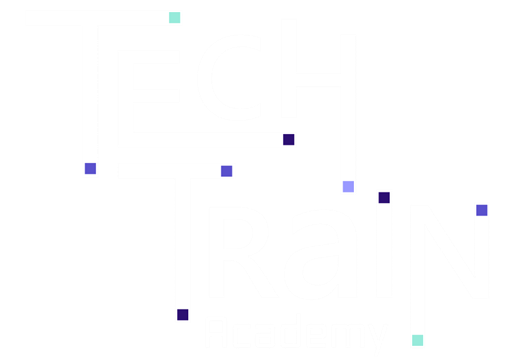

&nbsp;&nbsp;&nbsp;&nbsp;&nbsp;&nbsp;

 

# Tech Train - Mastering Dev Containers

- [Introduction](#introduction)
- [Workshops](#workshops)
- [Additional Resources](#additional-resources)
- [License](#license)

 

# Introduction 
Tech Train has arrived the station and we are excited to welcome you to the **Mastering Dev Containers** course! We hope that you will find this course informative and engaging. ☁️🚂
👨‍💻👩‍💻😊

A development container is a lightweight, portable, and reproducible environment that encapsulates your entire development stack. Imagine having a consistent environment across various stages of your project, ensuring that every team member, regardless of their local setup, experiences the same development environment. Dev containers leverage tools like Docker to encapsulate dependencies, libraries, and configurations, enabling seamless collaboration and eliminating the classic "it works on my machine" scenario. This modern approach empowers developers to spin up a containerized environment effortlessly, reducing setup time and fostering consistency, making your development journey smoother and more collaborative.

This hands-on course is designed for developers who want to gain practical experience with dev containers that can be used for a wide range of scenarios, such as web and backend development, data science, machine learning, and more.

In this course you will solve a series of challenges that will help you gain hands-on experience, with dev containers that can be used for a wide range of scenarios, such as web and backend development, data science, machine learning, and more.

 

# Workshops 
* [Prerequisites - Ready, Set, GO!](./docs/0-prerequisites-ready-set-go.md)
* Workshop 1: [Empowering Sara and Her Team with Dev Containers for .NET](./docs/1-workshop.md)
* Workshop 2: [Crafting a Rich Generative AI Development Environment for Lihi](./docs/2-workshop.md)

 

# Additional Resources 
| Name | Description |
|---|---|
| [Development Containers](https://containers.dev/) | An open specification for enriching containers with development specific content and settings |
| [GitHub Codespaces in Visual Studio Code](https://docs.github.com/en/codespaces/developing-in-a-codespace/using-github-codespaces-in-visual-studio-code)| Develop in your codespace directly in Visual Studio Code |
| [Dev Containers for C++ in Visual Studio](https://devblogs.microsoft.com/cppblog/dev-containers-for-c-in-visual-studio/) | Getting started with Dev Container in Visual Studio |
| [JetBrains - Dev Containers](https://www.jetbrains.com/help/idea/connect-to-devcontainer.html) | JetBrains - Dev Container Documentation |

 

# License 
This repository is licensed under MIT license. More info can be found [here](./LICENSE).
