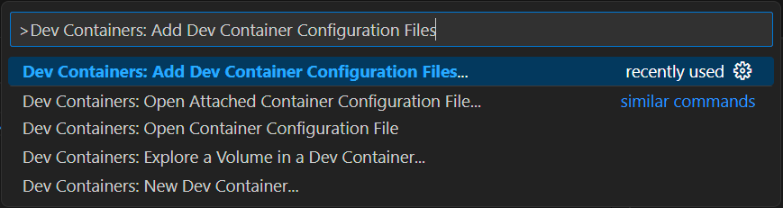

# Workshop 1: Empowering Sara and Her Team with Dev Containers for .NET

- [Introduction](#introduction)
- [Learning objectives](#learning-objectives)
- [Challenges](#challenges)
    - [Challenge 1: Create a .NET dev container configuration file](#challenge-1)
    - [Challenge 2: Build a Simple .NET Project Using CLI](#challenge-2)
    - [Challenge 3: Enhance and Customize a Dev Container](#challenge-3)
- [Additional resources](#additional-resources)


## Introduction <a name="introduction"></a>


Meet Sara, a Principal Software Engineer who recently joined Microsoft. With an extensive background in Java, Sara is excited to venture into the world of .NET to develop innovative products. However, she quickly finds herself overwhelmed by the complexities of the .NET ecosystem — .NET Framework, .NET Core, and .NET. Deciding which version to use, how to download and install them, and setting up a local development environment is proving to be a daunting challenge.

Sara's goal is straightforward: she wants a streamlined way to get started with her team's projects. She envisions a one-click solution that sets up her entire development environment effortlessly. The current complexity and frustration of setting up a local development environment drive her to seek a more efficient approach.

> **What is a development environment?** It's essentially a user-friendly collection of tools and settings required to write software. It might start with something as simple as a text editor, a compiler, and a debugger, but it can also include a database, a web server, and many other components. Advanced text editors like Visual Studio Code can provide a fully-featured development environment, but that's not always enough. For instance, if you are working on a project that requires a specific version of a programming language or a specific operating system library, you need to install and configure all these on your machine. Additionally, you need to support multiple projects and setups. This can become increasingly complex and time-consuming, leading to conflicts and errors, especially when working with a team of developers in parallel.

To assist Sara, you and the team decide to leverage Development Containers. Development containers are a way to define, package, and run a development environment that contains all the tools and runtime dependencies needed to work on a codebase. Based on Docker containers, they can be used to create a consistent and reproducible development environment across different machines and operating systems with just one click.

Central to this approach is the *devcontainer.json* file, which includes all the necessary metadata and settings required to configure a development container for a specific tool and runtime stack. This file can be used by tools and services supporting the dev container specification to create an environment that includes one or more development containers.

In this workshop, you will step into the role of a team member tasked with creating a rich .NET dev container to empower Sara and your teammates. By leveraging the power of development containers, you will provide a consistent, portable, and reproducible environment, enabling seamless collaboration and reducing setup time. Let's embark on this mission to make Sara's transition to .NET development smooth and efficient, and her onboarding process to the team a breeze!


## Learning Objectives <a name="learning-objectives"></a>
1. Understand the fundamentals of dev containers, including their structure and how they can streamline the development process.
1. Create and configure your first dev container, establishing a consistent local development environment tailored to your project needs.


## Challenges <a name="challenges"></a>

### Challenge 1: Create a .NET dev container configuration file <a name="challenge-1"></a>

Help Sara by creating a *devcontainer.json* file for her .NET development needs. This file should encapsulate everything required for .NET development, from specific .NET SDK versions to essential tools and libraries. By completing this task, you will provide a seamless development experience that will boost Sara's productivity and empower the whole team.

#### Guidance

1. Create a **devcontainer.json** file by opening the [Command Palette](https://code.visualstudio.com/docs/getstarted/userinterface#_command-palette) with `Ctrl` + `Shift` + `P` and selecting **Remote-Containers: Add Development Container Configuration Files...**.

    

1. Create a container configuration inside the current workspace by selecting **Add configuration to workspace**

    

1. There are many container configuration templates you could leverage for different uses, click **from a predefined container configuration definition...**

    

1. Search for **C# (.NET)** and select for a .NET development environment.
    To learn more about template you may click the **ⓘ** icon on the right.

    

1. Select **8.0-bookworm** as the .NET version Debian devcontainer base image.

    

1. You may select additional features to install, and then click **OK**

    

1. A new file **.devcontainer/devcontainer.json** was created, open it and review the content.
1. Update the **name** property with a unique name, then move the file to a new directory under the *.devcontainer* folder, for example **.devcontainer/sara/devcontainer.json**.
1. **Reopen in Container** feature in Visual Studio Code allows you to open your project inside a Docker container defined by a *devcontainer.json* configuration file. This feature provides a consistent development environment across different machines by ensuring that all the necessary tools, libraries, and configurations are contained within the Docker container.
    Here is what happens when you use the **Reopen in Container** option:
    1. **Detects configuration**: VS Code detects the *devcontainer.json* file in your project. This file defines the Docker image to use, extensions to install, environment variables, and other settings required for the development environment.
    1. **Builds the container**: If the Docker image specified in the *devcontainer.json* file does not exist locally, VS Code will build it or pull it from a Docker registry.
    1. **Starts the container**: Once the Docker image is available, VS Code starts a new container instance. This container acts as an isolated environment with the specified tools and dependencies.
    1. **Attaches to the container**: VS Code connects to the running container. Your workspace is now inside the container, and you can start working with the same code and tools defined in the *devcontainer.json* file.
    1. **Configures the environment**: Extensions and settings specified in the *devcontainer.json* file are applied. This includes installing VS Code extensions, setting up debugging configurations, and any other customizations.

    **Reopen in container** to open the project inside the dev container using one of the following approaches:

    1. VS Code will detect changes in the devcontainer configurations and will suggest to **Reopen in Container** inside a popup.
    

    1. Using the Remote Development extension shortcut on the bottom left corner of the VS Code window.
        1. Press the **><** icon.
        1. Select **Reopen in Container** Container.
        1. Using the [Command Palette](https://code.visualstudio.com/docs/getstarted/userinterface#_command-palette) by running `Ctrl` + `Shift` + `P` and selecting **Dev Containers: Reopen in Container**.

1. After the workspace will be opened, all the capabilities and extensions you configured are available in your devcontainer.
You can validate it by opening the terminal and running `dotnet --version`, command to view the version of Python installed in the environment.

With the creation of a dev container configuration file, Sara now understands how to create a reproducible environment for .NET and other development stacks. This step has equipped her with the knowledge to support various technologies, ensuring a consistent setup across all machines. The dev container encapsulates necessary tools and dependencies, allowing Sara to focus on coding rather than troubleshooting setup issues. This achievement marks a significant milestone in her journey into .NET development at Microsoft.


### Challenge 2: Build a Simple .NET Project Using CLI <a name="challenge-2"></a>

With the dev container configuration file in place, it's time to move forward and create a simple .NET blueprint project using the Command Line Interface (CLI). This foundational project will serve as the starting point for the team's future development efforts and ensure that everyone can build and run .NET applications smoothly within the containerized environment.

#### Guidance

1. Open a new terminal window using `Ctrl` + `Shift` + `~`.
1. Navigate to the directory where you want to create your project, for example:
    ```bash
    mkdir -p ./src/dotnet && cd ./src/dotnet
    ```
1. Review different dotnet sdk templates:
    ```bash
    dotnet new list
    ```
1. Use the following command to create a new console application:
    ```bash
    dotnet new webapi -n MasteringDevContainer
    ```

    This command will create a new folder named *MasteringDevContainer* containing a basic console application.
1. Navigate into the project folder:
    ```bash
    cd MasteringDevContainer
    ```
1. Open the explorer `Ctrl` + `shift` + `E` to review files in the project folder:
    ```bash
    .
    ├── ...
    ├── src                                         # Contains your code
    |   ├── dotnet                                  # .NET sample applications
    |   |   ├── MasteringDevContainer               # Contains your application
    |   |   |   ├── Properties                      # Contains project properties
    |   |   |   |   └── launchSettings.json         # Contains launch settings
    |   |   |   ├── appsettings.Development.json    # Contains development settings
    |   |   |   ├── appsettings.json                # Contains application settings
    |   |   |   ├── MasteringDevContainer.csproj    # Contains project settings
    |   |   |   ├── MasteringDevContainer.http      # Contains http requests
    |   |   |   └── Program.cs                      # Contains the main program
    |   ├── ...
    └── ...
    ```
1. Build and run your project:
    ```bash
    dotnet build && dotnet run
    ```

    This will compile your code and execute the webapi application.

    
1. Open a browser and navigate to the webapi URL using the **Open in Browser** button in the toast notification
    

    or by manually navigating to `https://localhost:{PORT}/weatherforecast`.

    > **Note:** The port number is displayed in the terminal output. In the example above, the port number is 5028. The port is configured in the `./Properties/launchSettings.json` file.

1. Review your webapi application in the browser.

    

    or via **[curl](https://curl.se/docs/manpage.html)**

    ```bash
    curl http://localhost:{PORT}/weatherforecast
    ```

After successfully building and running a simple .NET project using the CLI, Sara can now run any application based on .NET technology in her local development environment. This foundational step has empowered her to seamlessly dive into .NET development, leveraging the robust and consistent environment created by the dev container. With the CLI project up and running, Sara feels confident and ready to tackle more complex .NET projects, knowing she has a solid base to build upon. This achievement not only boosts her productivity but also fosters a sense of accomplishment and readiness to contribute effectively to her team's goals.


### Challenge 3: Enhance and Customize a Dev Container <a name="challenge-3"></a>

Now that Sara can run a .NET-based Web API application, she has noticed a few areas that need improvement:

1. **Azure Connectivity**: Sara deploys her Web API via Azure CLI and she would be happy to have the option to do this inside her local development environment.
1. **Linter Configuration**: When opening the **Program.cs** file, Sara found that there is no linter configured. Linters are crucial in any development environment as they help identify and fix code issues early, enforce coding standards, and improve code quality and readability.
1. **HTTP Requests Setup**: The .NET CLI generated a request example in the **MasteringDevContainer.http** file, but the dev container is not configured to run it, leaving Sara unable to test her API easily.

To make the dev container more tailored to the team's needs, further customization is necessary. This involves adding specific tools, libraries, and configurations commonly used in the projects. Help modify the dev container to enhance its functionality and usability. By enriching the dev container, you will ensure it meets the unique requirements of the team, thereby streamlining the development process and increasing overall productivity. Let's customize the dev container to create a complete development environment for the new Web API.

#### Guidance

1. Navigate to the **devcontainer.json** file.

1. **Integrate a Feature**: Features are self-contained units of installation code and development container configuration. They are designed to be installed on a wide range of base container images. For more information and available features, visit [Development Container Features](https://github.com/devcontainers/features).

    Add the following features to the **features** object to enable [Azure CLI](https://learn.microsoft.com/en-us/cli/azure/) in the dev container:

    | Name | Description | JSON |
    |---|---|---|
    | Azure CLI | Will be used to authenticate with Azure when resources are running locally | `"ghcr.io/devcontainers/features/azure-cli:1": { "version": "latest" }` |

    ```json
    "features": {
        "ghcr.io/devcontainers/features/azure-cli:1": {
            "version": "latest"
        }
    }
    ```

1. **Add Extensions**: Extensions are the primary way to add new functionality to VS Code. They can be installed from the [Visual Studio Code Marketplace](https://marketplace.visualstudio.com/vscode) and are built with the same APIs used by VS Code. You can browse and install extensions from within VS Code by clicking on the Extensions icon in the activity bar on the side of VS Code window or via **View -> Extensions** command.

    Add the following VS Code extensions to the **customizations.vscode.extensions** array:

    | Name | Description | Identifier |
    |---|---|---|
    | REST Client | REST Client for Visual Studio Code | `humao.rest-client` |
    | C# Dev Kit | Official C# extension from Microsoft | `ms-dotnettools.csdevkit` |

    ```json
    "customizations": {
        "vscode": {
            "extensions": [
                "humao.rest-client",
                "ms-dotnettools.csdevkit"
            ]
        }
    }
    ```

1. **Apply Changes**: Apply your changes using one of the following approaches:
    1. VS Code will detect changes in the devcontainer configurations and will suggest to **Rebuild** inside a popup.

        
    1. Using the Remote Development extension shortcut on the bottom left corner of the VS Code window.
        1. Press the **><** icon.
        1. Select **Rebuild Container**.

    1. Using the [Command Palette](https://code.visualstudio.com/docs/getstarted/userinterface#_command-palette) by running `Ctrl` + `Shift` + `P` and selecting **Dev Containers: Rebuild Container**.

1. **Validate**: After the container will be rebuilt, all the capabilities and extensions you configured are available in your devcontainer.
You can validate it by opening the terminal and running `az --version`, command to view the version of Azure CLI tool you just added. Also, you can open the **Extensions** view and validate that the **REST Client** and **C# Dev Kit** extensions are installed and functional.

1. **Customize Your Devcontainer (<span style="color:green"><b>Optional</b></span>)**: - Customize your devcontainer by adding an interesting and useful VS Code extension:
    1. Go to [Visual Studio Marketplace](https://marketplace.visualstudio.com/vscode) and search for an extension.
    1. Copy the **Unique Identifier** of the extension.
    1. Add the extension identifier to **customizations.vscode.extensions** array.
    1. Rebuild your devcontainer.
    1. Validate the extension is available in your devcontainer.

<p align="center">
<br />

<br />
</p>

By completing this workshop, you have gained a strong understanding of the fundamentals of dev containers, creating a local development environment. Your efforts have significantly improved the development process for Sara and the entire team. Well done on making a positive impact on your team's productivity and collaboration!


# Additional resources
| Name | Description |
|---|---|
| [Visual Studio Code - Create a Dev Container](https://code.visualstudio.com/docs/devcontainers/create-dev-container) | Create a Dev Container tutorial |
| [Dev Container metadata reference](https://aka.ms/devcontainer.json) | **devcontainer.json** Specification |
| [devcontainer.json schema](https://containers.dev/implementors/json_schema/) | Development Containers Specification |
| [Visual Studio Code Dev Containers Documentation](https://code.visualstudio.com/docs/remote/containers) | Learn more about Visual Studio Code dev containers |
