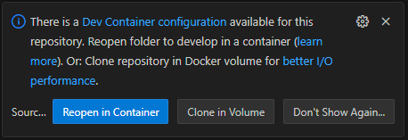

# Workshop 2: Crafting a Rich Generative AI Development Environment for Lihi

- [Introduction](#introduction)
- [Learning objectives](#learning-objectives)
- [Challenges](#challenges)
    - [Challenge 1: Create a Python dev container configuration file](#challenge-1)
    - [Challenge 2: Set up advanced configurations for a user-friendly development environment](#challenge-2)
    - [Challenge 3: Upgrade Dev Container runtime](#challenge-3)
    - [Challenge 4: Transform the Project into a Local Generative AI Playground](#challenge-4)
    - [Challenge 5: Optimize the Environment](#challenge-5)
- [Additional resources](#additional-resources)
- [Appendix](#appendix)
    - [Appendix A - Mounts](#appendix-a)
    - [Appendix B - Debug Python Uvicorn project](#appendix-b)


## Introduction <a name="introduction"></a>


Meet Lihi, a Data & Applied Scientist II at Microsoft, dedicated to creating the next generation of Generative AI models. Lihi's journey is filled with innovative ideas and complex challenges, especially with the fast-paced developments in small language models. Managing different models and SDKs, along with the constant switching between versions and dependencies, has created significant hurdles, slowing down her progress.

Currently, Lihi requires a playground to test her Generative AI business logic. However, using cloud resources has proven to be too expensive. She needs a local environment where she can test her theories and other necessary tools without incurring high costs.

In this workshop, you will step into the role of Lihi's team member. Your mission is to create a robust Python dev container that can handle the intricacies of working with Python, a web server, and Generative AI tools. By leveraging development containers, you will provide Lihi with a portable, reproducible, and hassle-free environment that streamlines her workflow, supporting her in delivering the next Generative AI chatbot.


## Learning Objectives <a name="learning-objectives"></a>
1. Practice environment setup and configuration to streamline the development process.
1. Leverage dev containers to tackle real-world scenarios.


## Challenges <a name="challenges"></a>

### Challenge 1: Create a Python dev container configuration file <a name="challenge-1"></a>

Assist Lihi in setting up a Python-based local environment. Lihi requires a robust development container configured with Python 3.11 and **[cURL](https://curl.se/docs/manpage.html)** for communication with her web application.

#### Guidance

1. Create a **devcontainer.json** file by opening the [Command Palette](https://code.visualstudio.com/docs/getstarted/userinterface#_command-palette) with `Ctrl` + `Shift` + `P` and selecting **Remote-Containers: Add Development Container Configuration Files...**.

    

1. Create a container configuration inside the current workspace by selecting **Add configuration to workspace**

    

1. There are many container configuration templates you could leverage for different uses, click **from a predefined container configuration definition...**

    

1. Search for **Python 3** and select for a Python development environment.
    To learn more about template you may click the **ⓘ** icon on the right.

    

1. Select **3.11-bullseye** to match Lihi's required Python version.

    

1. Select **cURL** as an additional features to install, and then click **OK**

    

1. A new file **.devcontainer/devcontainer.json** was created, open it and review the content.

1. Update the **name** property with a unique name, then move the file to a new directory under the *.devcontainer* folder, for example **.devcontainer/lihi/devcontainer.json**.

1. **Reopen in Container** using one of the following approaches:

    1. VS Code will detect changes in the devcontainer configurations and will suggest to **Reopen in Container** inside a popup.

        

    1. Using the Remote Development extension shortcut on the bottom left corner of the VS Code window.
        1. Press the **><** icon.
        1. Select **Reopen in Container** Container.
        1. Using the [Command Palette](https://code.visualstudio.com/docs/getstarted/userinterface#_command-palette) with `Ctrl` + `Shift` + `P`, and selecting **Dev Containers: Reopen in Container**.

1. After the workspace will be opened, all the capabilities and extensions you configured are available in your devcontainer.

    > You can validate it by opening the terminal and running `python --version`, command to view the version of Python installed in the environment.

1. **Reopen Folder Locally**: Exit the dev container workspace using one of the following approaches:

    1. Using the Remote Development extension shortcut on the bottom left corner of the VS Code window.
        1. Press the **><** icon.
        1. Select **Reopen Folder Locally**.
    1. Using the [Command Palette](https://code.visualstudio.com/docs/getstarted/userinterface#_command-palette) with `Ctrl` + `Shift` + `P`, and selecting **Dev Containers: Reopen Folder Locally**.

The dev container provided Lihi with a consistent and isolated environment with just one click, ensuring that her development setup is reproducible and portable across different machines.


### Challenge 2: Set up advanced configurations for a user-friendly development environment <a name="challenge-2"></a>

To create a user-friendly and fully-featured development environment for her codebase, Lihi needs your expertise in setting up advanced configurations. Your task is to enhance the Python dev container by incorporating tools and settings that streamline her workflow. This will not only improve productivity but also ensure that Lihi has all the necessary resources at her fingertips, making her development process smoother and more efficient.

#### Guidance

1. Navigate to the **devcontainer.json** file via File Explorer `Ctrl` + `shift` + `E` or using the [Command Palette](https://code.visualstudio.com/docs/getstarted/userinterface#_command-palette) with `Ctrl` + `Shift` + `P`, and selecting **Dev Containers: Open Container Configuration File**, and set up the following configurations:
    1. Setting the user in a dev container to a non-root user is recommended for several reasons:
        * **Security**: Running processes as a non-root user reduces the risk of accidental or malicious changes that could affect the entire system. This is a fundamental security practice to prevent privilege escalation and minimize potential damage.

        * **Best Practices**: Many development and deployment best practices suggest running applications with the least privileges necessary. Configuring a non-root user aligns with these best practices, ensuring a safer and more controlled environment.

        * **Consistency with Production Environments**: Often, production environments are configured to run applications as non-root users. Setting up your development environment to mirror this setup helps catch permission-related issues early and ensures consistency between development and production.

        * **File Permissions**: Running as a non-root user avoids issues with file permissions. Files created by the root user might have restricted access, causing problems when accessed by other users or processes.

        * **User Experience**: Some tools and services might not function correctly or expect to run as non-root users. Setting the remoteUser to a non-root user ensures a smoother and more predictable user experience.

        To set a non-root user, Update the **remoteUser** property to set a non-root user:

        ```json
        "remoteUser": "vscode"
        ```

    1. Lihi's web application based on [FastAPI](https://fastapi.tiangolo.com/) sample is located under */samples/python/webapp*. Open the explorer `Ctrl` + `shift` + `E` to review files in the project folder:

        ```bash
        .
        ├── ...
        ├── samples                                     # Contains your code
        |   ├── python                                  # Python sample applications
        |   |   ├── webapp                              # Contains web application sample
        |   |   |   ├── .vscode                         # VS Code workspace configurations
        |   |   |   |   └── launch.json                 # Contains launch settings
        |   |   |   ├── main.py                         # Contains the main program
        |   |   |   └── requirements.txt                # Contains python depenedencies
        |   |   ├── ...
        |   ├── ...
        └── ...
        ```

    1. The course repository's source code is organized to support multiple unrelated projects and samples. By default, the dev container loads all projects within the same repository if it detects a Git repo in the file structure. Reconfigure the dev container to mount only the specific web application project folder to the container.

        ```json
        // Requires workspaceFolder be set as well. Overrides the default local mount point for the workspace when the container is created. Supports the same values as the Docker CLI --mount flag. Environment and pre-defined variables may be referenced in the value.
        "workspaceMount": "source=${localWorkspaceFolder}/samples/python/webapp,target=/workspace,type=bind",

        // Requires workspaceMount be set. Sets the default path that devcontainer.json supporting services / tools should open when connecting to the container. Defaults to the automatic source code mount location.
        "workspaceFolder": "/workspace",
        ```

    1. When creating or working with a dev container, several hooks can be used to automate tasks at different stages of the container's lifecycle (e.g., postCreateCommand, postStartCommand). These hooks can be used to install dependencies, configure settings, or run scripts before or after the container is created or started, see more [Lifecycle-scripts](https://containers.dev/implementors/json_reference/#lifecycle-scripts).

        Update the **postStartCommand** property to install the Python dependencies from the *requirements.txt* file and greet Lihi each time the container is successfully started.

        ```json
        "postStartCommand": "pip3 install --user -r requirements.txt && echo '\nWelcome to the playground!\n'",
        ```

        Hooks, similar command execution in Linux, support bash operators to control the flow of the execution, handle input/output redirection and manage background processes:
        1. **Logical Operators**:
            1. `&&` (AND): Executes the next command only if the previous command succeeds.

                Example: `command1 && command2`
            1. `||` (OR): Executes the next command only if the previous command fails.

                Example: `command1 || command2`
        1. **Sequence Operators**:
            1. `;` (SEMICOLON): Executes the next command regardless of the success or failure of the previous command.

                Example: `command1; command2`

        and more, see [Bash Operator](https://linuxsimply.com/bash-scripting-tutorial/operator/#:~:text=B.%20Logical%20Operators%20in%20Bash%20Scripting%201%201.,...%203%203.%20%E2%80%9C%21%20%28NOT%29%E2%80%9D%20Logical%20Operator%20).

    1.  The **customizations.vscode** section allows you to specify VS Code settings, extensions, and other customizations that will be applied when the dev container is created and used. This ensures that the development environment inside the container is tailored to the project's needs, providing a consistent and productive experience for all developers working on the project, see more [Container specific settings](https://code.visualstudio.com/docs/devcontainers/containers#_container-specific-settings).

        Update the **customizations.vscode** section to set the Python interpreter path and install the Python extension.

        ```json
        "customizations": {
            "vscode": {
                // Set *default* container specific settings.json values on container create.
                "settings": {
                    "python.defaultInterpreterPath": "/usr/local/bin/python",
                    "python.pythonPath": "/usr/local/bin/python"
                },

                "extensions": [
                    "ms-python.python"
                ]
            }
        }
        ```

        > **Question**: What if I dont set the currect Python interpeter? see [Appendix B](#appendix-b).

1. **Apply Changes**: Apply your changes using one of the following approaches:
    1. VS Code will detect changes in the devcontainer configurations and will suggest to **Rebuild** inside a popup.

        
    1. Using the Remote Development extension shortcut on the bottom left corner of the VS Code window.
        1. Press the **><** icon.
        1. Select **Rebuild Container**.
    1. Using the [Command Palette](https://code.visualstudio.com/docs/getstarted/userinterface#_command-palette) with `Ctrl` + `Shift` + `P`, and selecting **Dev Containers: Rebuild Container**.

1. **Validate**: After the container will be opened, VS Code will be mounted only with the webapp folder and the webapp requirements will be installed. Validate the web application has all the necessary dependencies installed by running and testing the endpoint:
    1.  Open a new terminal with `Ctrl` + `Shift` + ``` ` ``` and run the web server:

        ```bash
        uvicorn main:app --host 0.0.0.0 --port 8000 --reload
        ```

        This will start the FastAPI web server by using pre-installed [Uvicorn](https://www.uvicorn.org/) web server implementation for Python.

        

    1. Open a new terminal with `Ctrl` + `Shift` + `5` and test the web application API:

        ```bash
        curl http://localhost:8000/
        ```

        The web application should respond with <span style="color:green"><b>{"message":"Hello World!"}</b></span>

By implementing these advanced configurations, you’ve established a secure and organized development environment that sets the foundation for Lihi’s work. However, this is just the beginning. There are more configurations to come that will further enhance her workspace, ensuring a fully optimized setup for tackling the complexities of Generative AI development.


### Challenge 3: Upgrade Dev Container runtime  <a name="challenge-3"></a>

With the announcement of the deprecation of Python 3.11, the security champion has requested that you update the Python version in Lihi’s dev container to 3.12. This update is essential to adhere to security standards and ensure compatibility with the latest tools and libraries. Your task is to modify the dev container configuration to accommodate this version change.

#### Guidance

1. **Open Container Configuration File**: Using the [Command Palette](https://code.visualstudio.com/docs/getstarted/userinterface#_command-palette) with `Ctrl` + `Shift` + `P`, and selecting **Dev Containers: Open Container Configuration File**.
1. **Update base image**: Modify the container configuration file and update the **image** property with a corresponding base image that supports Python 3.12:

    ```json
    "image": "mcr.microsoft.com/devcontainers/python:1-3.12-bullseye",
    ```

1. **Apply Changes**: Apply your changes using one of the following approaches:
    1. VS Code will detect changes in the devcontainer configurations and will suggest to **Rebuild** inside a popup.

        
    1. Using the Remote Development extension shortcut on the bottom left corner of the VS Code window.
        1. Press the **><** icon.
        1. Select **Rebuild Container**.
    1. Using the [Command Palette](https://code.visualstudio.com/docs/getstarted/userinterface#_command-palette) with `Ctrl` + `Shift` + `P`, and selecting **Dev Containers: Rebuild Container**.

1. **Validate dependencies**: Validate the Python version by running the following command in the terminal:

    ```bash
    python --version
    ```

    The terminal should display the Python version as <span style="color:green"><b>**3.12.x**</b></span>.

1. **Reopen Folder Locally**: Exit the dev container workspace using one of the following approaches:

    1. Using the Remote Development extension shortcut on the bottom left corner of the VS Code window.
        1. Press the **><** icon.
        1. Select **Reopen Folder Locally**.
    1. Using the [Command Palette](https://code.visualstudio.com/docs/getstarted/userinterface#_command-palette) with `Ctrl` + `Shift` + `P`, and selecting **Dev Containers: Reopen Folder Locally**.


### Challenge 4: Transform the Project into a Local Generative AI Playground <a name="challenge-4"></a>

Lihi needs a cost-effective, local environment to test her Generative AI business logic, avoiding the high expenses associated with cloud resources. Lihi has asked you to find a way to leverage the existing dev container into a comprehensive Generative AI playground. This involves integrating necessary tools and frameworks that will enable her to experiment, iterate, and refine her models efficiently on her local machine.

#### Guidance

1. **Review Project Files**: Lihi's Generative AI based on [Ollama Python Playground](https://github.com/pamelafox/ollama-python-playground) sample is located under */samples/python/ollama*. Open the explorer `Ctrl` + `shift` + `E` to review files in the project folder:

    ```bash
    .
    ├── ...
    ├── samples                                     # Contains your code
    |   ├── python                                  # Python sample applications
    |   |   ├── ollama                              # Contains Generative AI chat sample
    |   |   |   ├── chat.py                         # VS Code workspace configurations
    |   |   |   ├── hybrid.csv                      # Hybrid cars dataset sample
    |   |   |   ├── ollama.ipynb                    # Contains the main ollama Jupyter notebook
    |   |   |   ├── README.md                       # Project README.md file
    |   |   |   └── requirements.txt                # Contains python depenedencies
    |   |   ├── webapp                              # Contains web application sample
    |   |   ├── ...
    |   ├── ...
    └── ...
    ```

1. **Reconfigure Project Mounts**: Reconfigure the dev container to mount both of Lihi's project folders to the container by updating the **workspaceMount** property source.

    ```json
    "workspaceMount": "source=${localWorkspaceFolder}/samples/python,target=/workspace,type=bind",
    ```

1. **Reconfigure Hooks**: Reconfigure **postStartCommand** property to install the Python dependencies of both projects from the *requirements.txt* file each time the container is successfully started.

    ```json
    "postStartCommand": "pip3 install --user -r webapp/requirements.txt && pip3 install --user -r ollama/requirements.txt && echo '\nWelcome to the playground!\n'",
    ```

1. **Integrate Ollama Feature**: Enhance the project by adding the [Ollama](https://ollama.com/) feature, providing advanced tools and capabilities for Lihi's Generative AI LLMs development.

    ```json
    "ghcr.io/prulloac/devcontainer-features/ollama:1": {}
    ```

    > **Ollama**: is a free and open-source tool that lets anyone run open LLMs locally on your system. It supports Linux, Windows, and macOS. It is a command-line interface (CLI) tool that lets you conveniently download LLMs and run it locally and privately.

1. **Add Jupyter Notebook Extension**: Install the Jupyter Notebook extension in the dev container to enable interactive data analysis and model development.

    ```json
    "extensions": [
        "ms-toolsai.jupyter"
    ]
    ```

1. **Validate requirements.txt Dependencies**: Ensure that the *requirements.txt* file includes ipykernel to enable the execution of Jupyter Notebooks inside the dev container.

1. **Apply Changes**: Open the [Command Palette](https://code.visualstudio.com/docs/getstarted/userinterface#_command-palette) by pressing `Ctrl` + `Shift` + `P` and select **Dev Containers: Rebuild and Reopen in Container** to apply your changes.

1. **Validate Generative AI Dependencies**: After the container is opened, validate [Ollama](https://ollama.com/) feature and [OpenAI Python SDK](https://pypi.org/project/openai/). by running the following command in the terminal:

    ```bash
    ollama --help && pip3 show openai
    ```

    The terminal should display the Ollama help menu and the openai python sdk manifest.

1. **Pull Generative AI Model**: Manually pull [phi3](https://ollama.com/library/phi3), a Small Language Model (SLM) using Ollama.

    ```bash
    ollama pull phi3:mini
    ```

    That will take a few minutes to download the model into the local environment.

1. **Execute Generative AI**: Navigate to the */ollama/ollama.ipynb* file and click **Run All** to assess the Generative AI model.

    

    That will take a few minutes to execute the model on the local environment. Once the third cell is executed, you should expect a green colorized piratized welcome message generated by a Generative AI model on your local machine.

    

1. **Open Container Configuration File**: Using the [Command Palette](https://code.visualstudio.com/docs/getstarted/userinterface#_command-palette) with `Ctrl` + `Shift` + `P`, and selecting **Dev Containers: Open Container Configuration File**.

1. **Reconfigure Hooks**: Reconfigure **postStartCommand** property to pull the required LLM models.

    ```json
    "postStartCommand": "pip3 install --user -r webapp/requirements.txt && pip3 install --user -r ollama/requirements.txt && ollama pull phi3:mini && echo '\nWelcome to the playground!\n'",
    ```

By transforming the project into a local Generative AI playground, you have provided Lihi with a cost-effective environment to test and refine her business logic. This rich local environment, equipped with essential tools and frameworks like Jupyter Notebook, Ollama features, and generative AI models, enables Lihi to experiment and iterate efficiently with just one click.


### Challenge 5: Optimize the Environment <a name="challenge-5"></a>

Lihi has begun using the full-featured local environment you set up, but she is encountering a new challenge. Each day, it takes several minutes to restore all dependencies and models before she can start working, and managing models and hooks has become increasingly complex. To enhance her experience, help Lihi optimize the dev container for better performance and efficiency.

*Lihi's dev container start up example*


#### Guidance

1. **Open Container Configuration File**: Using the [Command Palette](https://code.visualstudio.com/docs/getstarted/userinterface#_command-palette) with `Ctrl` + `Shift` + `P`, and selecting **Dev Containers: Open Container Configuration File**.

1. **Automatically Upgrade Dependencies**:  It is a best practice to regularly update packages and dependencies to access the latest features, bug fixes, and security patches. For instance, in Lihi's terminal example above, there is a notification about a new release of *pip* being available.

    To automate this process, modify the **postStartCommand** property to automatically check for and update new package versions.

    ```json
    "postStartCommand": "sudo apt update -y && pip3 install --upgrade pip && ...",
    ```

1. **Hooks Management**: If hook configurations become complex, consider moving the logic to a bash script for easier management and maintenance.
    1. Ensure that the predefined bash script *./scripts/post-start-command.sh* exists relative to the mounted workspace and contains the following content:

        ```bash
        #!/bin/bash

        # Update the package index
        sudo apt update

        # Update pip
        pip3 install --upgrade pip

        # Install Python dependencies
        pip3 install --user -r webapp/requirements.txt
        pip3 install --user -r ollama/requirements.txt

        # Pull Generative AI Model
        ollama pull phi3:mini

        echo -e "\nWelcome to the playground!\n"
        ```

    1. Update hooks property to execute the bash script:

        ```json
        "postStartCommand": "./scripts/post-start-command.sh",
        ```

1. **Speed Up Using Mounts** - The startup time of the devcontainer can be lengthy due to the time required to update and restore all dependencies, which is influenced by factors such as local and external network bandwidth, CPU, and memory.
    Implementing effective mount strategies can help reduce this startup time by minimizing the amount of data that needs to be synchronized and restored during container startup.

    For instance, on a specific local machine, setting up Lihi's devcontainer took approximately <span style="color:red"><b>2.5 minutes</b></span>, because the SLM phi3 has a size of 2.2 GB. After applying an optimization strategy, the startup time was reduced to <span style="color:green"><b>2 seconds</b></span>.

    1. **Mount Python *site-packages***: To avoid downloading and reinstalling dependencies each time the container starts, mount a directory to the container. There are multiple approaches to achieve this; refer to [Appendix A - Mounts](#appendix-a) for a detailed explanation.
        1. Using **volume**:

            ```json
            "mounts": [
                "source=mastering-dev-containers,target=/home/vscode/.local/lib/python3.12,type=volume"
            ]
            ```

            > **Note**: you must use `-` (DASH) in the volume name because forward slash is a restricted character.

        1. Using **bind**: If you want to have the dependencies available relativily on the host machine.

            ```json
            "mounts": [
                "source=${localWorkspaceFolder}/samples/python/.dependencies,target=/home/vscode/.local/lib/python3.12,type=bind,consistency=cached
            ]
            ```

    1. **Grant permissions**: The container runs under the **remoteUser** `vscode` user, ensure that the user has the necessary permissions to access the mounted directory when the container is created.

        ```bash
        "postCreateCommand": "sudo chown -R vscode /home/vscode/.local"
        ```

    1. **Persist Ollama Models**: Ollama models can be large and take time to download. To avoid downloading the model each time the container starts, persist the model in a volume or bind mount.

        Ollama can be configured to store models in a different location by setting the environment variable `OLLAMA_MODELS`, see [Ollama FAQ](https://github.com/ollama/ollama/blob/main/docs/faq.md#how-do-i-set-them-to-a-different-location).

        For simplicity, configure Ollama models to be stored in the same mount directory used for Python by configuring a `OLLAMA_MODELS` environment variable using **containerEnv** property.

        ```json
        "containerEnv": {
            "OLLAMA_MODELS": "/home/vscode/.local/lib/python3.12/.ollama"
        },
        ```

1. **Apply Changes**: Open the [Command Palette](https://code.visualstudio.com/docs/getstarted/userinterface#_command-palette) by pressing `Ctrl` + `Shift` + `P` and select **Dev Containers: Rebuild and Reopen in Container** to apply your changes.

1. **Validate New Experience**: Validate all permissions and dependencies are in place, where the startup time should be significantly reduced. After the first time the container is opened and restored.

By optimizing the dev container, you have significantly improved Lihi's user experience. The reduced startup time allows her to start working almost immediately, without the daily wait for dependencies and models to restore. This enhancement ensures that Lihi can focus more on her innovative work with Generative AI, leading to increased productivity and a smoother development process.


<p align="center">
<br />

<br />
</p>


Throughout this workshop, you’ve successfully navigated the complexities of creating a tailored development environment for Lihi, a Data & Applied Scientist working on Generative AI models. From setting up a robust Python dev container to optimizing startup times and integrating essential tools, you’ve equipped Lihi with a powerful local playground that mirrors the capabilities of costly cloud resources, without the associated expenses.

By addressing challenges such as dependency management, environment customization, and performance optimization, you’ve not only enhanced Lihi’s workflow but also ensured that she can continue her innovative work with minimal interruptions. This workshop has reinforced the importance of creating efficient, user-friendly development environments that support rapid iteration and experimentation—key components in the fast-evolving field of Generative AI. As Lihi’s team member, you’ve played a crucial role in enabling her to focus on what she does best: pushing the boundaries of AI innovation.


# Additional resources
| Name | Description |
|---|---|
| [Phi-3 Cookbook](https://github.com/microsoft/Phi-3CookBook) | Working with the Phi-3 model |
| [Generative AI for Beginners](https://github.com/microsoft/generative-ai-for-beginners) | Learn more about Generative AI |
| [python-openai-demos](https://github.com/pamelafox/python-openai-demos) | Python based OpenAI demos |
| [Ollama samples](https://github.com/ollama/ollama?tab=readme-ov-file#extensions--plugins) | Ollama extensions and plugins |


## Appendix <a name="appendix"></a>

### Appendix A - Mounts <a name="appendix-a"></a>

When configuring mounts in a *devcontainer.json* file, there are different types of mounts to bind files or directories between your local filesystem and the container. These mounts can becrucial for sharing data, configuration files, or codebases between the host and the container.

There are different options to control how the file systems are mounted. Here are the key options available:
1. **type**: Defines the type of mount. Common types include:
    1. **Bind Mounts** - Bind a file or directory from the host system into the container. This type of mount is commonly used for code files or configuration directories.

        ```json
        "mounts": [
            "source=${localWorkspaceFolder}/data,target=/workspace/data,type=bind"
        ]
        ```

        Ideal for sharing source code between the host and the container, ensuring that changes on the host are reflected in the container.
    1. **Volume Mounts** - Volumes are managed by Docker and can be used to persist data. They are useful for storing data that needs to persist across container restarts and for sharing data between multiple containers.

        ```json
        "mounts": [
            "source=my-docker-volume,target=/workspace/data,type=volume"
        ]
        ```

        Useful for persisting data that should survive container restarts or for sharing data between multiple containers.
    1. **Temporary File System (tmpfs) Mounts** - Temporary file systems are useful for data that needs to be shared between containers but does not need to persist after the containers are stopped.

        ```json
        "mounts": [
            "source=tmpfs,target=/workspace/data,type=tmpfs"
        ]
        ```

        Great for ephemeral data that does not need to persist and where you want fast, in-memory storage.

1. **source** (or src): Specifies the source path on the host.
1. **target** (or dst or destination): Defines the target path inside the container.
1. **consistency**: Controls the consistency model for the mount. Options include:

    * **consistent**: Provides strong consistency guarantees.
    * **cached**: Optimizes for read-heavy workloads with a relaxed consistency model.
    * **delegated**: Optimizes for write-heavy workloads with a relaxed consistency model.
    * **readonly**: Sets the mount to be read-only. The container can read files from the mount but cannot write to it.

1. **volume-opt**: Allows you to specify additional options for volumes, such as size or driver options.

These options give you flexibility in configuring how data is shared and managed between your host system and containers, allowing you to optimize for performance, data persistence, and consistency based on your specific needs.


### Appendix B - Select Python Interpreter <a name="appendix-b"></a>

When working with Python projects in a dev container, it is essential to ensure that the correct Python interpreter is selected to avoid conflicts with Host or multiple interpeters.

If the interpeter in devcontainer is not configured and your host machine have different python interpeters you might see errors on the IDE, e.g. unresolved imports.


In order to solve it, you need to tell VS Code which Python interpeter to use.
1. Open Command Palette `Ctrl` + `Shift` + `P` and select **Python: Select Interpreter**.

    
1. Select the Python interpeter you would like to use from the list.

    
1. Validate issue was solved.

    
