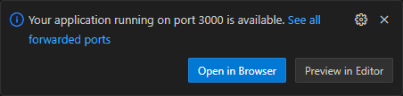
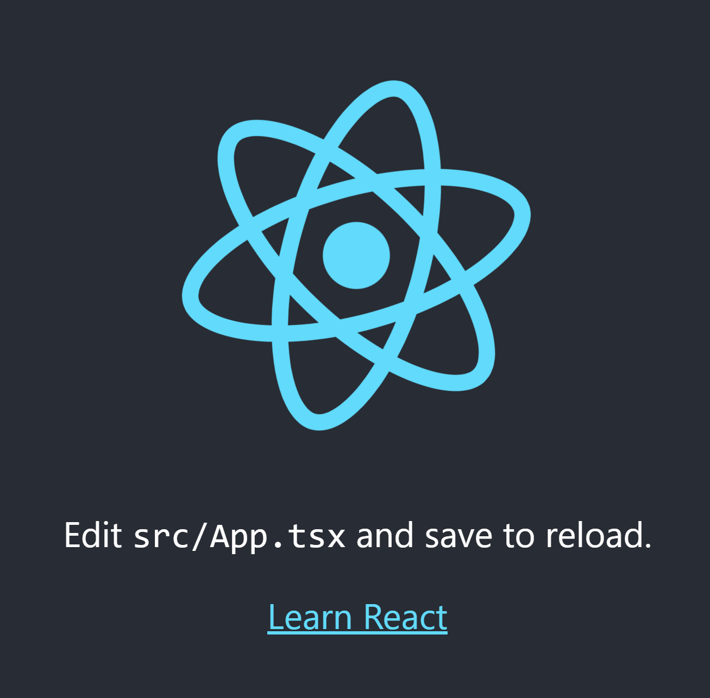
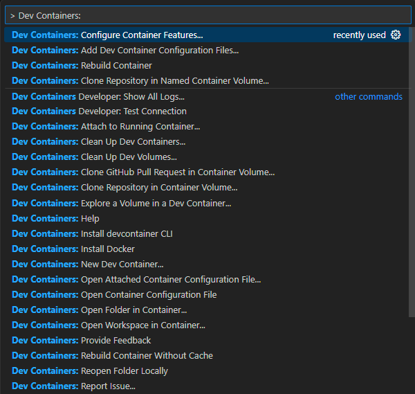

Node.js & Typescript
22-bookworm

1.reopen in container
1. node --version
>> v22.2.0
1. create new react - typescript application:
    1. Use npx to create a new React application with TypeScript template:
    ```bash
    npx create-react-app my-app --template typescript
    ```
    1. y
    1. Note it might take few minutes to install all the dependencies.
    1. cd my-app && npm start
1.once

Open in browser

or go to [http](http://localhost:3000)

1.

1.


>> bash: node: command not found
1. nvm install 18
1. node --version
>> v18.20.3
1. rebuild and check node is missing
1. Command Pallete: "Dev Containers: Configure Container Features..."
    
1.


https://dev.to/github/how-to-set-up-a-dev-container-for-a-nextjstypescript-app-2jd