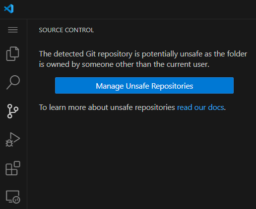

## enable git
1. `Ctrl` + `Shift` + `G` for source control

1. Click **Manage Unsafe Repositories** button
1. pick the **mastering-dev-containers** repository. This will allow enable you work with your repository source control within the devcontainer.
how to automate it?

## running multiple containers
[Connect to multiple containers](https://code.visualstudio.com/remote/advancedcontainers/connect-multiple-containers#:~:text=Connect%20to%20multiple%20containers%20in%20a%20single%20VS,%28%20F1%29%20and%20select%20Node%20Container.%20More%20items)